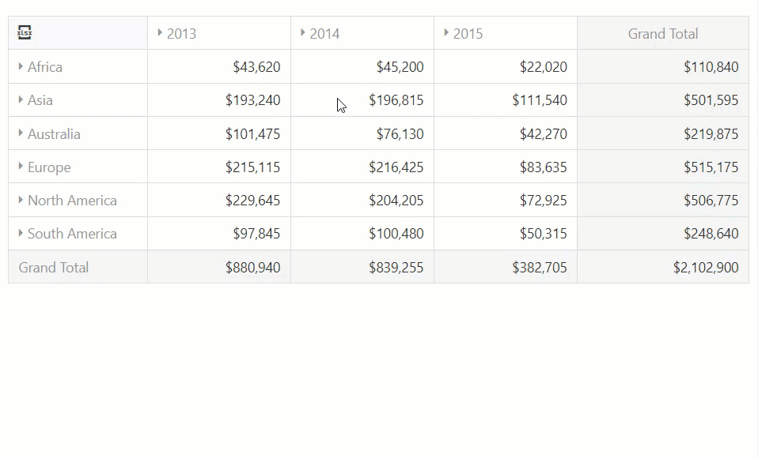

<!-- default badges list -->

<!-- default badges end -->
# PivotGrid for DevExtreme - How to edit data using DataGrid

This example demonstrates how to use the DataGrid component and PivotGrid's [Drill Down](https://js.devexpress.com/Demos/WidgetsGallery/Demo/PivotGrid/DrillDown) feature to edit data in PivotGrid.

## Implementation Details

1. Implement the [onCellClick](https://js.devexpress.com/Documentation/ApiReference/UI_Widgets/dxPivotGrid/Configuration/#onCellClick) event handler to get information about the current cell and use the [createDrillDownDataSource](https://js.devexpress.com/Documentation/ApiReference/Data_Layer/PivotGridDataSource/Methods/#createDrillDownDataSourceoptions) method to get plain data. Then, bind DataGrid to these values.  

1. Define the [onRowUpdating](https://js.devexpress.com/Documentation/ApiReference/UI_Widgets/dxDataGrid/Configuration/#onRowUpdating), the [onRowRemoving](https://js.devexpress.com/Documentation/ApiReference/UI_Widgets/dxDataGrid/Configuration/#onRowRemoving), and the [onRowInserting](https://js.devexpress.com/Documentation/ApiReference/UI_Widgets/dxDataGrid/Configuration/#onRowInserting) functions to update real PivotGrid data while changing in-memory values.

1. Implement the [onHiding](https://js.devexpress.com/Documentation/ApiReference/UI_Widgets/dxPopup/Configuration/#onHiding) event handler to [reload data](https://js.devexpress.com/Documentation/Guide/Data_Binding/Update_Data/#DevExtreme_DataSource/Data_Shaping) in PivotGrid after a user closes a popup with the grid.

## Files to Review

- **jQuery**
    - [index.js](jQuery/src/index.js)
- **Angular**
    - [app.component.html](Angular/src/app/app.component.html)
    - [app.component.ts](Angular/src/app/app.component.ts)
- **Vue**
    - [App.vue](Vue/src/App.vue)
- **React**
    - [App.js](React/src/App.js)
- **ASP.NET**    
    - [Index.cshtml](ASP.NET/PivotGrid - Editing using DataGrid/Views/Home/Index.cshtml)

## Documentation

- [Getting Started with PivotGrid](https://js.devexpress.com/Documentation/Guide/UI_Components/PivotGrid/Getting_Started_with_PivotGrid/)
- [Getting Started with DataGrid](https://js.devexpress.com/Documentation/Guide/UI_Components/DataGrid/Getting_Started_with_DataGrid/)

## More Examples

- [PivotGrid - Drill Down](https://js.devexpress.com/Demos/WidgetsGallery/Demo/PivotGrid/DrillDown)
